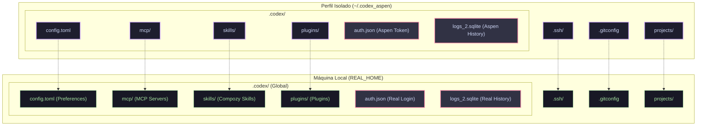

# ⚡️ Ultron CLI

> Gerenciador concorrente e inteligente de múltiplos perfis para o OpenAI Codex.

[](https://bun.sh)
[](https://www.typescriptlang.org/)
[](https://apple.com)

O **Ultron** é um utilitário de terminal ultra-rápido desenvolvido em **TypeScript** e compilado nativamente com **Bun**. Ele permite o uso de múltiplas identidades (ex: *aspen*, *pessoal*, *work*) no OpenAI Codex de forma **100% simultânea**, compartilhando suas ferramentas, configurações e MCPs globais, mas isolando seus tokens de login, históricos de chat e memórias.

---

## 🏗️ Arquitetura

O funcionamento se baseia em duas técnicas: **HOME Spoofing** (simulação de diretório raiz) e **Selective Symlinking** (criação de atalhos seletivos).



---

## 🛠️ O que é Compartilhado vs. Isolado

| Tipo | Recurso | Estado | Descrição |
| :--- | :--- | :--- | :--- |
| 🔒 **Isolado** | `auth.json` | **Exclusivo** | Token de login e sessão ativa da conta OpenAI. |
| 🔒 **Isolado** | `logs_2.sqlite` | **Exclusivo** | Histórico de todas as conversas do chat. |
| 🔒 **Isolado** | `memories_1.sqlite` | **Exclusivo** | Banco de memórias personalizadas que a IA cria sobre você. |
| 🔒 **Isolado** | `sessions/` | **Exclusivo** | Logs brutos das sessões ativas do terminal. |
| 🤝 **Compartilhado** | `config.toml` | **Vinculado** | Preferências gerais do Codex (Modelo de IA, limites de contexto, tema). |
| 🤝 **Compartilhado** | `mcp/` & `plugins/` | **Vinculado** | Configuração e manifestos dos servidores MCP instalados. |
| 🤝 **Compartilhado** | `.ssh/` & `.gitconfig` | **Vinculado** | Suas chaves SSH e dados do Git para trabalhar sem barreiras nos repositórios. |

---

## 🚀 Instalação Rápida

Certifique-se de ter o [Bun](https://bun.sh) instalado. No diretório do projeto, execute o comando de instalação:

```bash
pnpm install # ou bun install
bun run install
```

O instalador irá automaticamente:
1. Compilar o TypeScript em um binário nativo ultra-rápido (`bin/ultron-cli`).
2. Mover o binário para `~/.local/bin/ultron-cli`.
3. Inserir os ganchos do wrapper (`ultron` e `codex`) no seu `~/.zshrc`.

Após finalizar, recarregue o terminal:
```bash
source ~/.zshrc
```

---

## 💡 Como Usar

### Alternar Perfil
Configura a variável de ambiente para isolar os logins, mas mantém o terminal ativo.
```bash
ultron aspen
```

### Alternar Perfil e Abrir o Codex
Ativa o perfil correspondente e já inicia a interface de terminal do Codex sob o TTY correto.
```bash
ultron aspen -o
# ou
ultron pessoal --open
```

### Resetar para o Padrão
Limpa a variável do Ultron e volta a utilizar a pasta padrão do Codex (`~/.codex`).
```bash
ultron reset
```

### Exibir Ajuda
```bash
ultron --help
```
